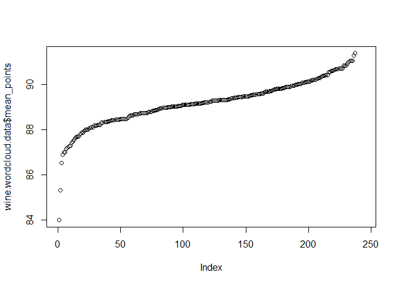
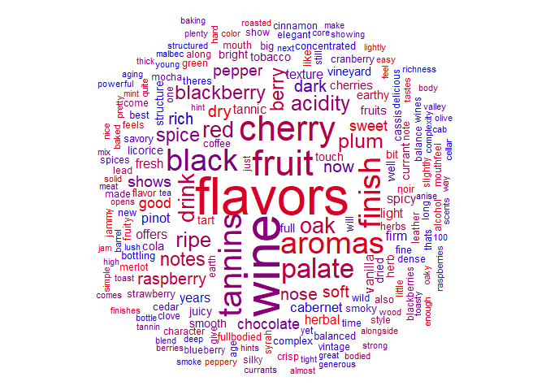

Wine Data Word Cloud
================

Outline
-------

In this markdown document we'll walk through the process of building a wordcloud to analyse word frequency. Quite a while ago now I did a course on datacamp.com that covered frequency analysis and constructing wordclouds. I did have to go back and remind myself of a few things put that is where the techniques come from.

Packages
--------

As usual, these are the packages used in the R script:

``` r
library("tidyr")
library("dplyr")
library("wordcloud")
```

    FALSE Warning: package 'wordcloud' was built under R version 3.5.1

``` r
library("tm")
```

    FALSE Warning: package 'tm' was built under R version 3.5.1

-   We'll use tidyr and dplyr for some simple data manipulation;

-   the tm package allows us to work with our text by creating a corpus and from there a Term Document Matrix;

-   and the wordcloud package givues us what we need to plot our wordcloud!

Read the Data
-------------

``` r
wine.data <- read.csv("winemag-data-130k-v2.csv",
                      stringsAsFactors = FALSE)
```

I've gathered the wine data from the following kaggle page:

It contains information on a variety of different wines. Let's take a look at what it has:

``` r
glimpse(wine.data)
```

    ## Observations: 129,971
    ## Variables: 14
    ## $ X                     <int> 0, 1, 2, 3, 4, 5, 6, 7, 8, 9, 10, 11, 12...
    ## $ country               <chr> "Italy", "Portugal", "US", "US", "US", "...
    ## $ description           <chr> "Aromas include tropical fruit, broom, b...
    ## $ designation           <chr> "Vulkà Bianco", "Avidagos", "", "Reserv...
    ## $ points                <int> 87, 87, 87, 87, 87, 87, 87, 87, 87, 87, ...
    ## $ price                 <dbl> NA, 15, 14, 13, 65, 15, 16, 24, 12, 27, ...
    ## $ province              <chr> "Sicily & Sardinia", "Douro", "Oregon", ...
    ## $ region_1              <chr> "Etna", "", "Willamette Valley", "Lake M...
    ## $ region_2              <chr> "", "", "Willamette Valley", "", "Willam...
    ## $ taster_name           <chr> "Kerin Oâ\200\231Keefe", "Roger Voss", "...
    ## $ taster_twitter_handle <chr> "@kerinokeefe", "@vossroger", "@paulgwin...
    ## $ title                 <chr> "Nicosia 2013 Vulkà Bianco  (Etna)", "Q...
    ## $ variety               <chr> "White Blend", "Portuguese Red", "Pinot ...
    ## $ winery                <chr> "Nicosia", "Quinta dos Avidagos", "Rains...

As mentioned, we've got all sorts of data here. We won't be using all of this, it's the description column that we're interested in. This is a character column containing a few sentences used by the wine taster to describe the wines. We'll use this column to build a word cloud that will give us some insight into which words are the most popular when describing wines.

As a final step, We'll try using a colour scale to see if we can determine which words correlate to a good wine score and which words are more closely associated with a bad wine score.

Reducing Data Size
------------------

The first thing we need to do is cut down the number of observations in the dataset (my laptop can't handle all these rows once we start working with the tm package functions).

So how can we cut down our number of observations? Well, the data set contains A LOT of different grape varieties:

``` r
length(unique(wine.data$variety))
```

    ## [1] 708

`length(unique(wine.data$variety))` different grapes! Why don't we look at a particular subset of these varieties? How about only red wines? (spoiler: that won't cut it down enough) Only the top 10 red wines? (second spoiler: my laptop will still kick up a fuss) Only the top 10 red wines from France? Well, that might just do it.

Let's get a list of the most popular red grape varieties. A bit of googling gave me the following 10 varieties:

``` r
top.red.wines <- c("Cabernet Sauvignon", "Merlot", "Pinot Noir", "Zinfandel", "Syrah",
                   "Shiraz", "Malbec", "Tempranillo", "Sangiovese", "Barbera", "Carménère")
```

(There are 11 here but I'm told Syrah and Shiraz are the same grape so we'll bunch those toghether.)

We need to make sure these are all present in our data. Some might be missing if they commonly go by a different name or I've mispelled the grape name:

``` r
unique(wine.data$variety[wine.data$variety %in% top.red.wines])
```

    ##  [1] "Pinot Noir"         "Cabernet Sauvignon" "Malbec"            
    ##  [4] "Merlot"             "Sangiovese"         "Zinfandel"         
    ##  [7] "Syrah"              "Barbera"            "Shiraz"            
    ## [10] "Tempranillo"

That's not all of them, we're missing "Carménère". Let's see if we can find what that is listed as in the data. We'll pull all the varieties into a vector and then use grepl() to look for the character pattern "Carm" (note we use the ^ character to only pull rows where "Carm" is at the start of the string):

``` r
varieties <- unique(wine.data$variety)

varieties[grepl("^Carm", varieties)]
```

    ## [1] "Carmenère"                    "Carmenère-Cabernet Sauvignon"
    ## [3] "Carmenère-Syrah"

We've got three here. The last two are blends so we'll ignore those but the first one looks like a diferent spelling / some strange character behaviour for our grape "Carménère". We'll replace the spelling in our top.red.wines vector with the spelling in the data set:

``` r
top.red.wines[top.red.wines == "Carménère"] <- varieties[grepl("^Carm", varieties)][1]
```

Now we can see we're matching all 11 of the varieties:

``` r
unique(wine.data$variety[wine.data$variety %in% top.red.wines])
```

    ##  [1] "Pinot Noir"         "Cabernet Sauvignon" "Malbec"            
    ##  [4] "Merlot"             "Sangiovese"         "Carmenère"        
    ##  [7] "Zinfandel"          "Syrah"              "Barbera"           
    ## [10] "Shiraz"             "Tempranillo"

Let's filter our data so it contains only our chosen varities of grape:

``` r
wine.data.red <- wine.data %>%
  filter(variety %in% top.red.wines)
```

How much have we reduced the size by?

``` r
dim(wine.data.red)
```

    ## [1] 42003    14

From `dim(wine.data)[[1]]` to `dim(wine.data.red[[1]])`, not bad. Unforunately we'll have to do better, our last resort is just taking a sample of points from our current dataset.

``` r
set.seed(1000)
sample.rows <- sample(nrow(wine.data.red))[1:10000]
wine.data.sample <- wine.data.red[sample.rows,]
```

Getting our Data Ready
----------------------

We'll start by using the corpus function to turn our description column into a corpus of text:

``` r
wine.corpus <- Corpus(VectorSource(wine.data.sample$description))
```

Now that we've got a corpus we can start doing some tidying of the character data. We'll be using the tm\_map() function to perform a few different transformations on our data. Start by converting everything to lower case:

``` r
wine.corpus <- tm_map(wine.corpus, content_transformer(tolower))
```

    ## Warning in tm_map.SimpleCorpus(wine.corpus, content_transformer(tolower)):
    ## transformation drops documents

... then remove all punctuation:

``` r
wine.corpus <- tm_map(wine.corpus, removePunctuation)
```

    ## Warning in tm_map.SimpleCorpus(wine.corpus, removePunctuation):
    ## transformation drops documents

... and eliminate white space:

``` r
wine.corpus <- tm_map(wine.corpus, stripWhitespace)              
```

    ## Warning in tm_map.SimpleCorpus(wine.corpus, stripWhitespace):
    ## transformation drops documents

The last thing we'll do at this stage is remove stopwords. These are common words in the English language that will just be noise in our wordcloud. Words like "and" or "the", that give us no insight into that words that are often used to specifically describe wine.

``` r
wine.corpus <- tm_map(wine.corpus, removeWords, stopwords("english"))
```

    ## Warning in tm_map.SimpleCorpus(wine.corpus, removeWords,
    ## stopwords("english")): transformation drops documents

There might be some more words we want to remove that are more unique to our dataset. Once we've got our data in our desired format we'll look at removing some user chosen words.

Term Document Matrix
--------------------

Convert our Corpus into a Term Document Matrix. This will allow us to count the frequency of each word in our Corpus:

``` r
wine.tdm <- TermDocumentMatrix(wine.corpus)          
```

Convert to a matrix for manipulation:

``` r
wine.matrix <- as.matrix(wine.tdm)
```

Sum the rows to get a vector of frequencies. Order this vector:

``` r
wine.vector <- sort(rowSums(wine.matrix),decreasing=TRUE)
```

Store the words and their corresponding frequencies in a data.frame.

``` r
wine.wordcloud.data <- data.frame(word = names(wine.vector),
                                  freq = wine.vector)
```

And now let's take a look:

``` r
head(wine.wordcloud.data,
     n = 10)
```

    ##            word freq
    ## flavors flavors 5512
    ## wine       wine 5212
    ## fruit     fruit 3623
    ## cherry   cherry 3443
    ## tannins tannins 3108
    ## aromas   aromas 2994
    ## black     black 2963
    ## finish   finish 2918
    ## palate   palate 2671
    ## drink     drink 1989

Filtering on Frequency
----------------------

We'll filter on a mean frequency now. We could actually do this in the wordcloud plot call but we'll apply it here since we're going to do a bit of work (using an ugly for loop so the quicker we can make it the better).

``` r
wine.wordcloud.data <- wine.wordcloud.data %>% 
  filter(freq >= 200)
```

Add Mean Wine Score by Word
---------------------------

For each word, we'll get the mean score of every wine where this word appears in the description. That way, we can get a picture of which words are used for good scoring wines and which aren't. Warning: This isn't going to be a particularly rigorous piece of analysis, it's just an inteesting addition to the wordcloud.

Let's initialize a mean points column:

``` r
wine.wordcloud.data <- wine.wordcloud.data %>%
  mutate(mean_points = 0)
```

We'll use a for loop to find the average score for each word and bolt it on:

``` r
for(i in wine.wordcloud.data$word){
  
  y <- wine.data.sample %>%
    filter(grepl(i, description)) %>%
    summarise(mean_points = mean(points))
  
  wine.wordcloud.data$mean_points[wine.wordcloud.data$word == i] <- y[[1]]
  
}
```

Order by mean points:

``` r
wine.wordcloud.data <- wine.wordcloud.data %>%
  arrange(mean_points)
```

This is what we've got:

``` r
head(wine.wordcloud.data,
     n = 10)
```

    ##          word freq mean_points
    ## 1  fullbodied  541    84.00000
    ## 2      simple  269    85.31933
    ## 3       green  455    86.51991
    ## 4      little  378    86.90217
    ## 5      merlot  418    87.00000
    ## 6       feels  442    87.01170
    ## 7      tastes  337    87.15468
    ## 8        easy  271    87.20811
    ## 9      herbal  787    87.26567
    ## 10      heavy  223    87.28889

Assigning Colours to Mean Points
--------------------------------

We need a way to assign a colour value to our points column.

Look at the shape of the distribution of points:

``` r
plot(wine.wordcloud.data$mean_points)
```



We were hoping for a linear distribution. This is close enough though.

Well do quite a basic (and rough) application of a colour value to each point using the colorRampPalette function:

``` r
# Get unique values and assign a colour
colfunc <- colorRampPalette(c("red", "blue"))
```

Wordcloud
---------

Now we can plot our wordcloud using the wordcloud() function:

``` r
# And let's build the wordcloud
wordcloud(words = wine.wordcloud.data$word, freq = wine.wordcloud.data$freq, 
          min.freq = 100,
          max.words=200, random.order=FALSE, rot.per=0.35,
          ordered.colors = TRUE,
          colors = colfunc(nrow(wine.wordcloud.data)))
```


